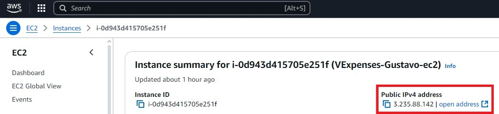
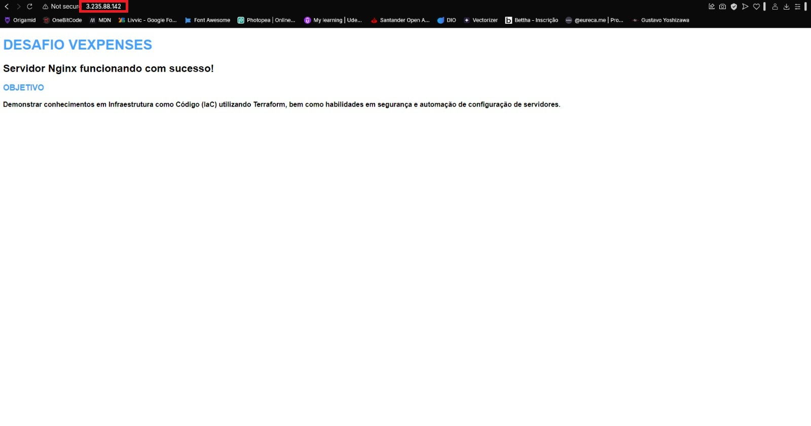

## Desafio VExpenses

## Tarefa 1

### Configuração do Provedor AWS
Define a AWS como o provedor de nuvem e estabelece a região us-east-1 para a criação dos recursos.
```hcl
provider "aws" {
  region = "us-east-1"
}
```

### Variáveis de Projeto e Candidato
Define variáveis para armazenar o nome do projeto e do candidato. Elas são usadas para nomear recursos dinamicamente.
```hcl
variable "projeto" {
  description = "Nome do projeto"
  type        = string
  default     = "VExpenses"
}

variable "candidato" {
  description = "Nome do candidato"
  type        = string
  default     = "Gustavo"
}
```

### Chave SSH
Gera um par de chaves RSA de 2048 bits para acesso SSH seguro à instância EC2.
```hcl
resource "tls_private_key" "ec2_key" {
  algorithm = "RSA"
  rsa_bits  = 2048
}
```

Cria um par de chaves na AWS, associando a chave pública à EC2.
```hcl
resource "aws_key_pair" "ec2_key_pair" {
  key_name   = "${var.projeto}-${var.candidato}-key"
  public_key = tls_private_key.ec2_key.public_key_openssh
}
```

### VPC e Subnet
Cria uma VPC (Virtual Private Cloud) com o bloco CIDR 10.0.0.0/16, ativando DNS support e DNS hostnames.
```hcl
resource "aws_vpc" "main_vpc" {
  cidr_block           = "10.0.0.0/16"
  enable_dns_support   = true
  enable_dns_hostnames = true

  tags = {
    Name = "${var.projeto}-${var.candidato}-vpc"
  }
}
```

Cria uma subnet dentro da VPC com o bloco 10.0.1.0/24 e associada à zona de disponibilidade us-east-1a.
```hcl
resource "aws_subnet" "main_subnet" {
  vpc_id            = aws_vpc.main_vpc.id
  cidr_block        = "10.0.1.0/24"
  availability_zone = "us-east-1a"

  tags = {
    Name = "${var.projeto}-${var.candidato}-subnet"
  }
}
```

### Internet Gateway e Roteamento
Cria um Internet Gateway para permitir que os recursos dentro da VPC se comuniquem com a internet.
```hcl
resource "aws_internet_gateway" "main_igw" {
  vpc_id = aws_vpc.main_vpc.id

  tags = {
    Name = "${var.projeto}-${var.candidato}-igw"
  }
}
```

Cria uma tabela de rotas que direciona todo o tráfego (0.0.0.0/0) para o Internet Gateway.
```hcl
resource "aws_route_table" "main_route_table" {
  vpc_id = aws_vpc.main_vpc.id

  route {
    cidr_block = "0.0.0.0/0"
    gateway_id = aws_internet_gateway.main_igw.id
  }

  tags = {
    Name = "${var.projeto}-${var.candidato}-route_table"
  }
}
```

Associa a subnet à tabela de rotas, garantindo que a instância EC2 possa acessar a internet.
```hcl
resource "aws_route_table_association" "main_association" {
  subnet_id      = aws_subnet.main_subnet.id
  route_table_id = aws_route_table.main_route_table.id
}
```

### Grupos de Segurança
Cria um Security Group para controlar o tráfego da instância EC2.
Entrada: Permite conexões SSH (porta 22) de qualquer IP.
Saída: Permite todo tráfego de saída sem restrições.

### ❌Acesso SSH irrestrito
O código permite acesso SSH de qualquer IP (0.0.0.0/0), o que representa um risco de segurança.

### ❌Falta de suporte para HTTP e HTTPS
A configuração do grupo de segurança não permite tráfego HTTP e HTTPS, impedindo o acesso à aplicação via navegador.

```hcl
resource "aws_security_group" "main_sg" {
  name        = "${var.projeto}-${var.candidato}-sg"
  description = "Permitir SSH de qualquer lugar e todo o tráfego de saída"
  vpc_id      = aws_vpc.main_vpc.id

  ingress {
    description      = "Allow SSH from anywhere"
    from_port        = 22
    to_port          = 22
    protocol         = "tcp"
    cidr_blocks      = ["0.0.0.0/0"]
    ipv6_cidr_blocks = ["::/0"]
  }

  egress {
    description      = "Allow all outbound traffic"
    from_port        = 0
    to_port          = 0
    protocol         = "-1"
    cidr_blocks      = ["0.0.0.0/0"]
    ipv6_cidr_blocks = ["::/0"]
  }
}
```

### Imagem do Sistema Operacional
Busca a AMI mais recente do Debian 12 com virtualização HVM e publicada pelo dono 679593333241.
```hcl
data "aws_ami" "debian12" {
  most_recent = true

  filter {
    name   = "name"
    values = ["debian-12-amd64-*"]
  }

  filter {
    name   = "virtualization-type"
    values = ["hvm"]
  }

  owners = ["679593333241"]
}
```

### Instância EC2
Configura uma instância EC2 com as seguintes características:
- Tipo: t2.micro (uso gratuito da AWS).
- AMI: Debian 12.
- Subnet: Associada à main_subnet.
- Chave SSH: Usa a chave gerada anteriormente.
- Grupo de Segurança: Usa main_sg.
- IP Público: Associado automaticamente.
- Volume de Disco: 20GB, gp2, excluído ao término da instância.
- User Data: Atualiza o sistema (`apt-get update && upgrade`).

### Outputs
Exibe a chave privada SSH.

### ❌Falta de armazenamento local da chave privada
O código exibe a chave privada, mas sem armazená-la adequadamente no sistema de arquivos.

```hcl
output "private_key" {
  description = "Chave privada para acessar a instância EC2"
  value       = tls_private_key.ec2_key.private_key_pem
  sensitive   = true
}
```

Exibe o endereço IP público da instância EC2 para acesso remoto.
```hcl
output "ec2_public_ip" {
  description = "Endereço IP público da instância EC2"
  value       = aws_instance.debian_ec2.public_ip
}
```


## Tarefa 2

### Melhorando o código

### ✅ Restrição do acesso SSH a um IP específico
Agora, o SSH só pode ser acessado de um IP definido na variável `ssh_cidr`.

### ✅ Adição de suporte para HTTP e HTTPS
O grupo de segurança permite acesso via navegador.

```terraform
variable "ssh_cidr" {
  description = "CIDR do IP autorizado para acesso SSH"
  type        = string
  default     = "152.244.41.225/32" # IP do meu computador
}

resource "aws_security_group" "sg" {
  name        = "meu_sg"
  description = "Regras de segurança para a EC2"

  ingress {
    from_port   = 22
    to_port     = 22
    protocol    = "tcp"
    cidr_blocks = [var.ssh_cidr] #  SSH restrito a um IP específico
  }

  ingress {
    from_port   = 80
    to_port     = 80
    protocol    = "tcp"
    cidr_blocks = ["0.0.0.0/0"] # HTTP liberado para acesso público
  }

  ingress {
    from_port   = 443
    to_port     = 443
    protocol    = "tcp"
    cidr_blocks = ["0.0.0.0/0"] # HTTPS liberado para acesso público
  }

  egress {
    from_port   = 0
    to_port     = 0
    protocol    = "-1"
    cidr_blocks = ["0.0.0.0/0"]
  }
}
````

### ✅ Armazenamento seguro da chave privada
A chave privada agora é salva localmente com permissões adequadas.

```terraform
resource "tls_private_key" "chave_ssh" {
  algorithm = "RSA"
  rsa_bits  = 4096
}

resource "local_file" "chave_privada" {
  filename      = "chave-privada.pem"
  content       = tls_private_key.chave_ssh.private_key_pem
  file_permission = "0400" # Permissão segura para a chave
}

resource "aws_key_pair" "chave" {
  key_name   = "minha-chave"
  public_key = tls_private_key.chave_ssh.public_key_openssh
}
```

### ✅ Instalação automática do Nginx na EC2
Agora, a EC2 já inicia com o Nginx instalado.

```terraform
user_data = <<-EOF
  #!/bin/bash
    apt-get update -y
    while sudo fuser /var/lib/dpkg/lock >/dev/null 2>&1; do sleep 1; done
    apt-get upgrade -y
    apt-get install -y nginx
    systemctl enable nginx
    systemctl start nginx
  EOF
```

## **Pré-requisitos**
Antes de iniciar, certifique-se de que possui os seguintes requisitos instalados e configurados:

- **Terraform**: Instalado e configurado corretamente.
- **AWS CLI**: Configurado com suas credenciais de acesso.
- **Conta AWS**: Permissões para criar instâncias EC2, configurar regras de segurança e gerenciar VPCs.

---

## **Passo a passo**

### **1. Clone o repositório**
Para começar, baixe o código do repositório:

```bash
git clone https://github.com/gustavoyoshizawa/DesafioVExpenses
```

Acesse o diretório do projeto:

```bash
cd DesafioVExpenses
```

### **2. Inicialize o Terraform**
Antes de aplicar as configurações, inicialize o Terraform no diretório do projeto:

```bash
terraform init
```

### **3. Revise o plano de execução**
Antes de criar os recursos, verifique o que será provisionado:

```bash
terraform plan
```

### **4. Aplique o plano para criar os recursos**
Agora, execute o seguinte comando para criar a infraestrutura:

```bash
terraform apply -auto-approve
```

Isso provisionará uma instância EC2 com o Nginx instalado e configurado.

### **5. Acesse a instância EC2 via SSH**
Após a criação, pegue o IP público da instância e conecte-se via SSH:

```bash
ssh -i "chave-privada.pem" admin@ec2-3-235-88-142.compute-1.amazonaws.com -p 22
```

### **6. Verifique se o servidor está rodando**
Dentro da instância, execute o comando:

```bash
systemctl status nginx
```

Se o Nginx estiver ativo e rodando, você verá uma saída indicando que o serviço está funcionando corretamente.

### **7. Acesse a aplicação via navegador**
Abra seu navegador e acesse:

```
http://<IP_DA_INSTÂNCIA>
```


Se tudo estiver correto, você verá a página personalizada.

### **8. (Opcional) Editar o conteúdo do site**
Se precisar alterar o conteúdo da página HTML, edite o arquivo diretamente na instância:

```bash
sudo nano /var/www/html/index.html
```


Após fazer as alterações, salve (`Ctrl + O` e `Enter`) e saia (`Ctrl + X`).

Reinicie o Nginx para aplicar as mudanças:

```bash
sudo systemctl restart nginx
```
---

## **Remover a infraestrutura**
Caso queira excluir todos os recursos provisionados, basta rodar o seguinte comando:

```bash
terraform destroy -auto-approve
```
---
